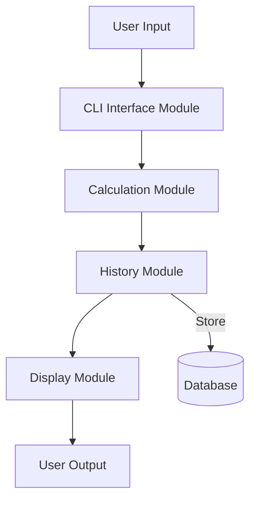

**Архитектурный документ для CLI калькулятора с историей операций**

**1. Структура модулей:**

- **CLI Interface Module:** Отвечает за взаимодействие с пользователем через командную строку. Использует библиотеки `Click` для Python или `Commander` для Node.js.
- **Calculation Module:** Обрабатывает математические выражения и возвращает результат. Использует безопасные парсеры выражений, такие как `sympy` для Python или `mathjs` для Node.js.
- **History Module:** Управляет историей операций, включая добавление новых записей и очистку старых. Может использовать `SQLAlchemy` для хранения в базе данных.
- **Display Module:** Форматирует и выводит результаты и историю операций. Использует `Rich` для Python или `Chalk` для Node.js.

**2. Потоки данных:**

1. Пользователь вводит математическое выражение через CLI Interface Module.
2. Calculation Module обрабатывает выражение и возвращает результат.
3. History Module сохраняет выражение и результат в истории.
4. Display Module выводит результат и обновленную историю операций пользователю.

**3. Mermaid диаграмма:**

**4. API контракты:**

- **CLI Interface Module:**
  - `parseInput(expression: str) -> str`: Парсит пользовательский ввод и передает его в Calculation Module.

- **Calculation Module:**
  - `evaluateExpression(expression: str) -> float`: Принимает строку выражения и возвращает числовой результат.

- **History Module:**
  - `addToHistory(expression: str, result: float) -> None`: Добавляет запись в историю.
  - `getHistory() -> List[str]`: Возвращает список всех операций из истории.

- **Display Module:**
  - `displayResult(result: float) -> None`: Форматирует и выводит результат.
  - `displayHistory(history: List[str]) -> None`: Форматирует и выводит историю операций.

**Рекомендации по реализации:**

- **Безопасность:** Избегайте использования `eval` для обработки выражений. Используйте безопасные библиотеки для парсинга.
- **Управление памятью:** Реализуйте механизм ограничения размера истории операций.
- **Обработка ошибок:** Включите валидацию ввода и обработку исключений для предотвращения сбоев.

Этот архитектурный документ предоставляет полное руководство по созданию CLI калькулятора с историей операций, включая структуру модулей, потоки данных, диаграмму и API контракты.