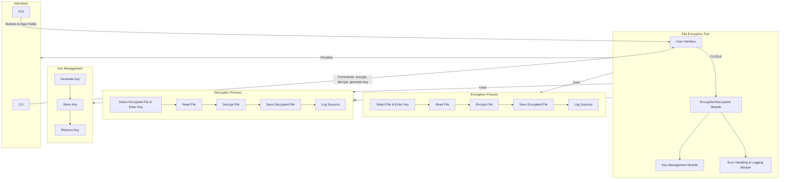

This diagram represents the architecture of a file encryption tool using AES. It includes modules for encryption/decryption, key management, error handling, and logging. The tool supports both CLI and GUI interfaces for user interaction. The data flow for encryption and decryption processes is shown, highlighting the steps from file selection to logging the success of operations. Key management processes such as key generation, storage, and retrieval are also depicted.