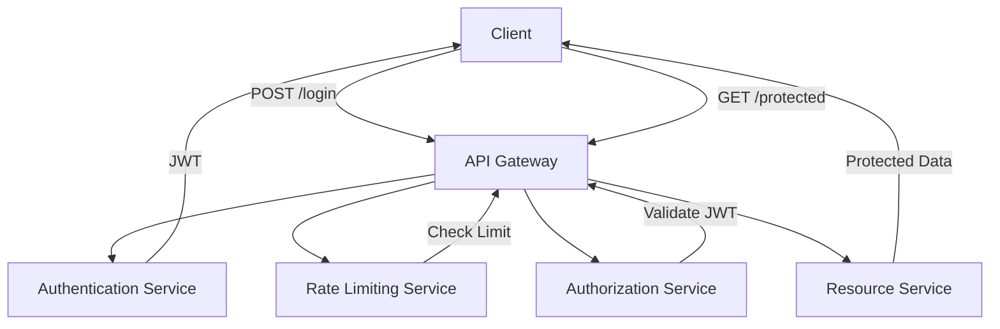

**Архитектурный документ для масштабируемой структуры проекта Secure REST API с JWT аутентификацией и ограничением частоты запросов**

### 1. Структура модулей и классов

#### Основные компоненты:
- **Authentication Service**: Обрабатывает аутентификацию пользователей и генерацию JWT.
- **Authorization Service**: Проверяет права доступа пользователей на основе JWT.
- **Rate Limiting Service**: Управляет ограничением частоты запросов.
- **API Gateway**: Центральная точка входа для всех запросов, обрабатывает аутентификацию и ограничение частоты запросов.
- **User Service**: Управляет данными пользователей и их профилями.
- **Resource Service**: Обрабатывает доступ к защищенным ресурсам.

#### Классы:
- **User**: Представляет пользователя системы.
- **Token**: Представляет JWT токен.
- **RateLimiter**: Управляет логикой ограничения частоты запросов.

### 2. Потоки данных

1. **Аутентификация**:
   - Клиент отправляет запрос на `/login` с учетными данными.
   - **Authentication Service** проверяет учетные данные и генерирует JWT.
   - JWT возвращается клиенту.

2. **Доступ к защищенным ресурсам**:
   - Клиент отправляет запрос с JWT в заголовке на `/protected`.
   - **API Gateway** проверяет JWT через **Authorization Service**.
   - Если токен действителен, запрос передается в **Resource Service**.
   - **Resource Service** возвращает защищенные данные.

3. **Ограничение частоты запросов**:
   - **Rate Limiting Service** отслеживает количество запросов от каждого клиента.
   - Если лимит превышен, клиент получает ошибку 429 (Too Many Requests).

### 3. Mermaid диаграмма

### 4. API контракты

#### `/login` (POST)
- **Request**: 
  - Headers: `Content-Type: application/json`
  - Body: `{ "username": "string", "password": "string" }`
- **Response**:
  - 200 OK: `{ "token": "string" }`
  - 401 Unauthorized: `{ "error": "Invalid credentials" }`

#### `/protected` (GET)
- **Request**:
  - Headers: `Authorization: Bearer <token>`
- **Response**:
  - 200 OK: `{ "message": "Protected data" }`
  - 403 Forbidden: `{ "error": "Invalid token" }`
  - 429 Too Many Requests: `{ "error": "Rate limit exceeded" }`

### Заключение

Эта архитектура обеспечивает масштабируемость и безопасность REST API с использованием современных библиотек и паттернов. Использование микросервисной архитектуры и API Gateway позволяет централизовать управление безопасностью и ограничением частоты запросов, обеспечивая гибкость и надежность системы.