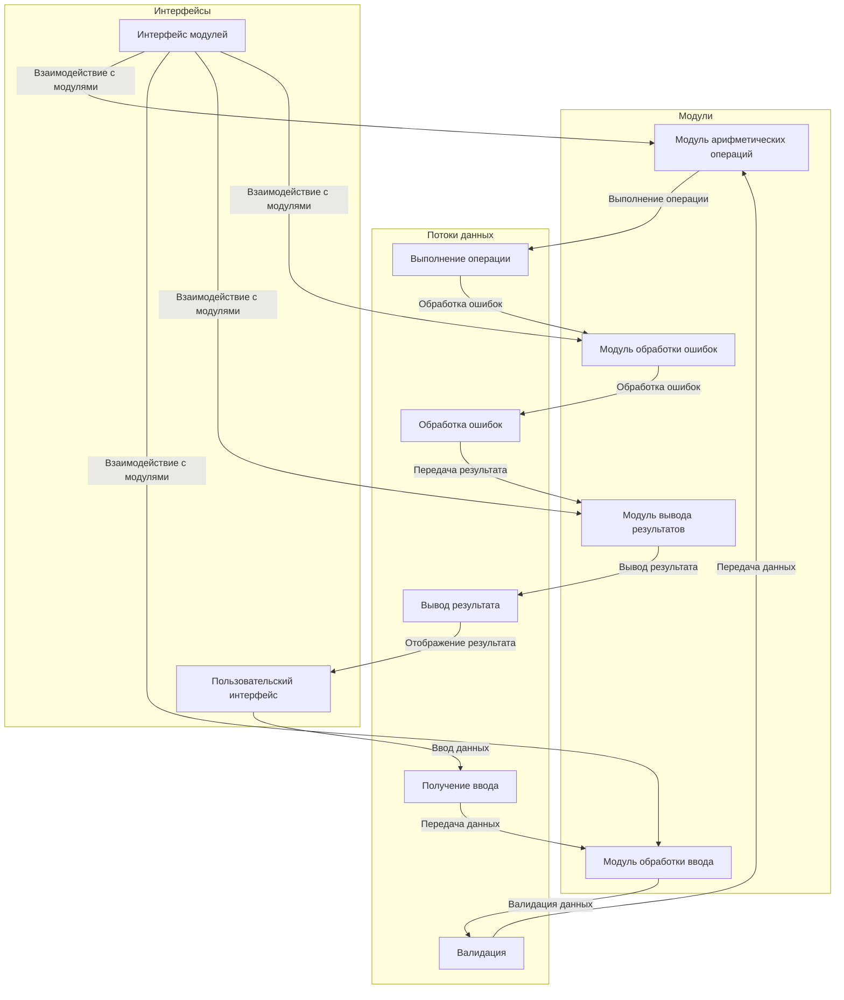

# 🧮 Simple Calculator CLI

## 📖 Описание
Simple Calculator CLI — это простое приложение командной строки, которое позволяет выполнять базовые арифметические операции: сложение, вычитание, умножение и деление. Оно разработано с учетом модульности и простоты использования, что позволяет легко расширять функциональность.

## 🚀 Быстрый старт

### Установка
1. Склонируйте репозиторий:
   ```bash
   git clone https://github.com/yourusername/simple-calculator-cli.git
   cd simple-calculator-cli
   ```

2. Установите зависимости:
   ```bash
   pip install -r requirements.txt
   ```

### Запуск
Запустите приложение:
```bash
python calculator.py
```

### Пример использования
Введите операцию и два числа, например:
```
+ 3 4
```
Вывод:
```
Result: 7
```

## 🐳 Docker инструкции

### Сборка образа
Для сборки Docker-образа выполните следующую команду в корневом каталоге проекта:
```bash
docker build -t simple-calculator-cli .
```

### Запуск контейнера
Запустите контейнер с приложением:
```bash
docker run --rm simple-calculator-cli
```

### Проверка состояния
Вы можете проверить состояние контейнера с помощью команды:
```bash
docker ps
```

## 📂 Структура проекта
```
simple-calculator-cli/
├── calculator.py          # Основной файл приложения
├── requirements.txt       # Зависимости проекта
├── Dockerfile             # Инструкции для сборки Docker-образа
└── README.md              # Документация проекта
```

## 📊 Визуальный анализ


## 🛠️ Заключение
Архитектура Simple Calculator CLI спроектирована с учетом модульности и простоты использования. Разделение на модули позволяет легко поддерживать и расширять функциональность приложения. Следуя этому руководству, вы сможете быстро начать работу с приложением и использовать его для выполнения базовых арифметических операций.