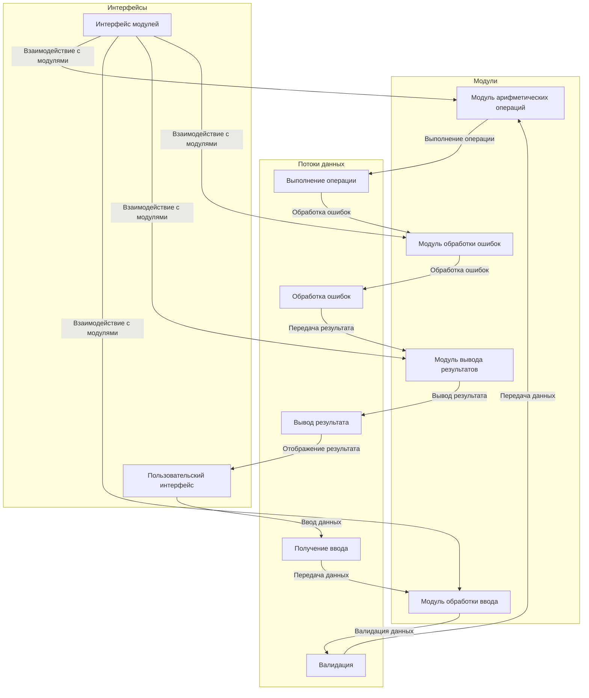

This diagram represents the architecture of a Simple Calculator CLI, highlighting the modules, data flows, and interfaces involved in processing user input, performing arithmetic operations, handling errors, and displaying results.