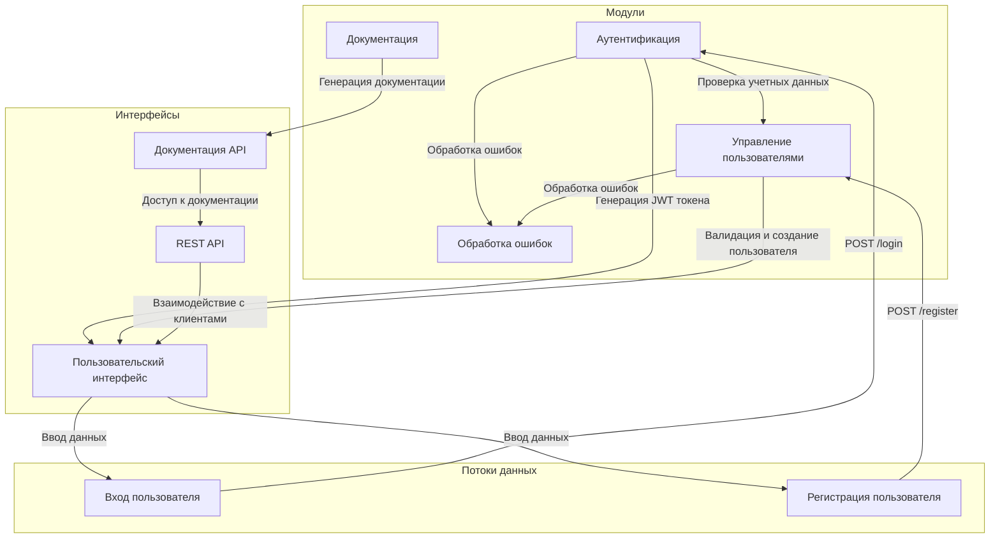

# 🚀 Simple REST API Documentation

## 📖 Описание
Simple REST API — это легковесное приложение, предназначенное для аутентификации пользователей и управления их данными. Оно предоставляет интерфейсы для входа и регистрации, а также включает в себя централизованную обработку ошибок и документацию API с использованием Swagger/OpenAPI.

## ⚡ Быстрый старт

### Установка
1. Клонируйте репозиторий:
   ```bash
   git clone https://github.com/your_username/simple-rest-api.git
   cd simple-rest-api
   ```

2. Установите зависимости:
   ```bash
   pip install -r requirements.txt
   ```

3. Запустите приложение:
   ```bash
   python main.py
   ```

4. Откройте браузер и перейдите по адресу: [http://localhost:8080](http://localhost:8080) для доступа к API.

### Примеры использования
- **Регистрация нового пользователя**:
   ```bash
   curl -X POST http://localhost:8080/register -H "Content-Type: application/json" -d '{"username": "testuser", "password": "testpass"}'
   ```

- **Вход пользователя**:
   ```bash
   curl -X POST http://localhost:8080/login -H "Content-Type: application/json" -d '{"username": "testuser", "password": "testpass"}'
   ```

## 🐳 Docker инструкции

### Запуск с помощью Docker
1. Соберите образ:
   ```bash
   docker build -t simple-rest-api .
   ```

2. Запустите контейнер:
   ```bash
   docker run -d -p 8080:8080 simple-rest-api
   ```

3. Проверьте, что приложение работает, перейдя по адресу: [http://localhost:8080](http://localhost:8080).

### Dockerfile
```dockerfile
FROM python:3.11-slim AS builder

WORKDIR /app

COPY requirements.txt .

RUN pip install --no-cache-dir -r requirements.txt

FROM python:3.11-slim

WORKDIR /app

COPY --from=builder /usr/local/lib/python3.11/site-packages /usr/local/lib/python3.11/site-packages
COPY --from=builder /usr/local/bin /usr/local/bin
COPY . .

RUN addgroup --system appgroup && adduser --system --ingroup appgroup appuser
USER appuser

EXPOSE 8080

HEALTHCHECK --interval=30s --timeout=10s --retries=3 CMD curl -f http://localhost:8080/ || exit 1

LABEL maintainer="your_email@example.com" \
      version="1.0" \
      description="A simple REST API for user authentication and registration"

CMD ["python", "main.py"]
```

## 📂 Структура проекта
```
simple-rest-api/
├── main.py                # Основной файл приложения
├── requirements.txt       # Зависимости проекта
├── Dockerfile             # Инструкции для сборки Docker-образа
└── README.md              # Документация проекта
```

## 📊 Визуальный анализ


## 📌 Заключение
Создание простого REST API для экрана входа в систему включает в себя проектирование модульной архитектуры, которая обеспечивает безопасность, валидацию данных и удобство использования. Следуя лучшим практикам и используя подходящие инструменты, такие как Express.js или Flask, можно создать надежное и масштабируемое приложение. Важно также обеспечить качественную документацию и обработку ошибок для улучшения взаимодействия с разработчиками и пользователями.