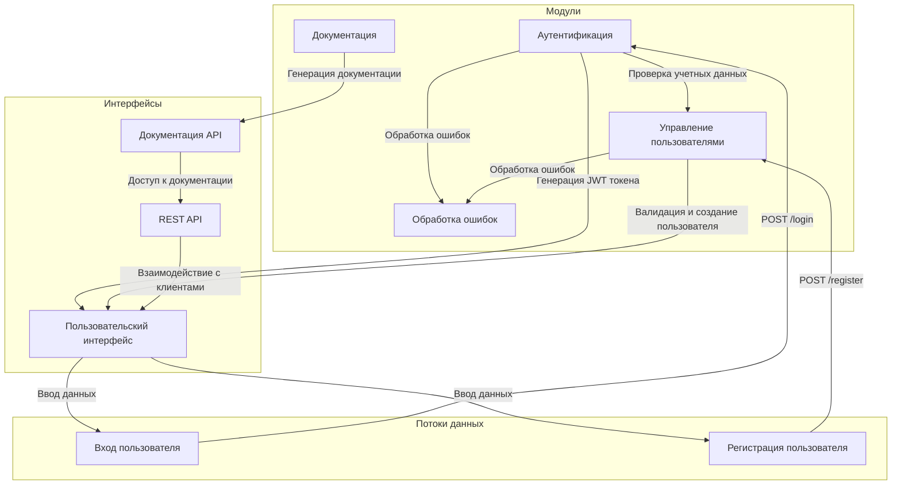

```mermaid
flowchart TD
    subgraph Модули
        A1[Аутентификация]
        A2[Управление пользователями]
        A3[Обработка ошибок]
        A4[Документация]
    end

    subgraph Потоки данных
        B1[Вход пользователя]
        B2[Регистрация пользователя]
    end

    subgraph Интерфейсы
        C1[REST API]
        C2[Пользовательский интерфейс]
        C3[Документация API]
    end

    C2 -->|Ввод данных| B1
    C2 -->|Ввод данных| B2
    B1 -->|POST /login| A1
    B2 -->|POST /register| A2
    A1 -->|Проверка учетных данных| A2
    A1 -->|Генерация JWT токена| C2
    A2 -->|Валидация и создание пользователя| C2
    A1 -->|Обработка ошибок| A3
    A2 -->|Обработка ошибок| A3
    A4 -->|Генерация документации| C3
    C1 -->|Взаимодействие с клиентами| C2
    C3 -->|Доступ к документации| C1
```

This diagram represents the architecture of a Simple REST API, highlighting the modules, data flows, and interfaces involved in user authentication and registration processes.