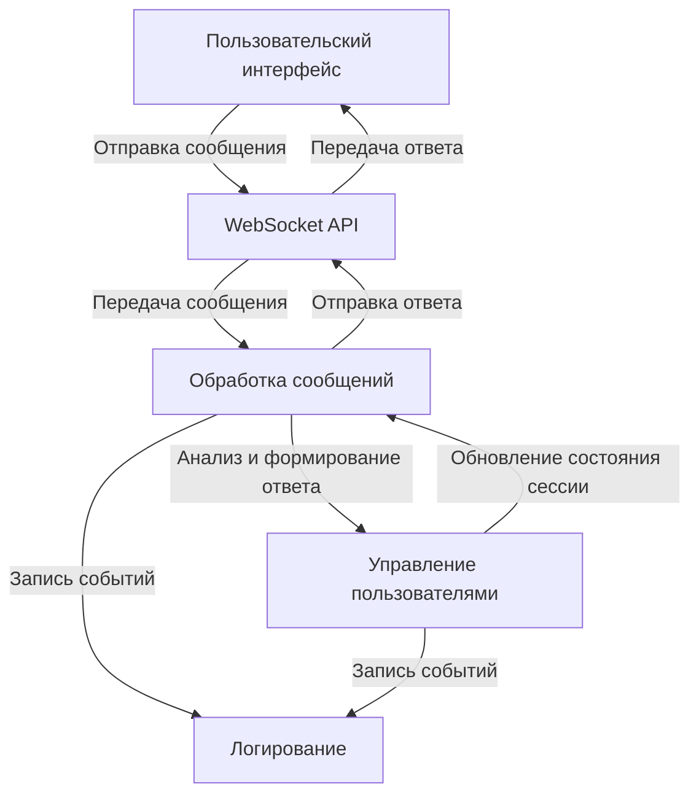

```markdown
# Простой чат-бот с использованием WebSocket 🤖

## Описание
Этот проект представляет собой простой чат-бот, использующий WebSocket для обмена сообщениями в реальном времени. Бот обрабатывает входящие сообщения, управляет сессиями пользователей и ведет логирование для мониторинга и отладки.

## Быстрый старт 🚀

1. **Клонируйте репозиторий:**
   ```bash
   git clone https://github.com/yourusername/simple-chat-bot.git
   cd simple-chat-bot
   ```

2. **Установите зависимости:**
   ```bash
   pip install -r requirements.txt
   ```

3. **Запустите сервер:**
   ```bash
   python app.py
   ```

4. **Подключитесь к WebSocket-серверу:**
   Используйте клиент WebSocket для подключения к `ws://localhost:8765`.

## Docker инструкции 🐳

Для запуска приложения в контейнере Docker выполните следующие шаги:

1. **Соберите образ:**
   ```bash
   docker build -t simple-chat-bot .
   ```

2. **Запустите контейнер:**
   ```bash
   docker run -d -p 8765:8765 simple-chat-bot
   ```

3. **Проверьте состояние контейнера:**
   ```bash
   docker ps
   ```

## Структура проекта 📁

```
simple-chat-bot/
├── app.py                # Основной файл приложения
├── requirements.txt      # Зависимости проекта
├── Dockerfile            # Инструкции для сборки Docker-образа
└── README.md             # Документация проекта
```

## Визуальный анализ 📊



## Заключение
Создание простого чат-бота с использованием WebSocket требует четкой модульной архитектуры, которая включает обработку сообщений, управление пользователями и логирование. Следуя этим рекомендациям, можно создать эффективное и масштабируемое приложение, способное обрабатывать взаимодействия с пользователями в реальном времени.
```