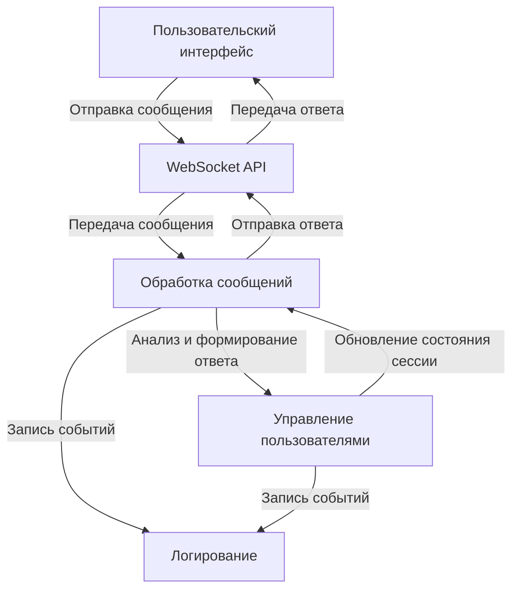

```mermaid
flowchart TD
    A[Пользовательский интерфейс] -->|Отправка сообщения| B[WebSocket API]
    B -->|Передача сообщения| C[Обработка сообщений]
    C -->|Анализ и формирование ответа| D[Управление пользователями]
    D -->|Обновление состояния сессии| C
    C -->|Отправка ответа| B
    B -->|Передача ответа| A
    C -->|Запись событий| E[Логирование]
    D -->|Запись событий| E
```