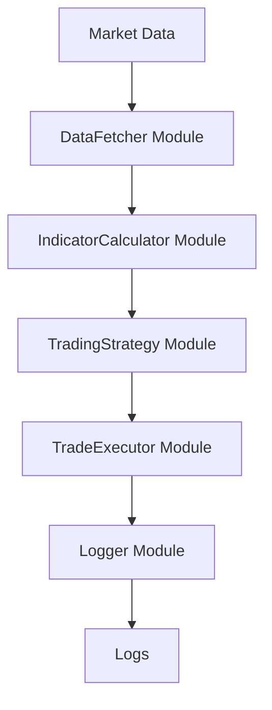

**Архитектурный документ для высокопроизводительного торгового бота с использованием RSI и Bollinger Bands**

**1. Структура модулей и классов:**

- **DataFetcher Module:**
  - **Classes:**
    - `ExchangeAPI`: Интерфейс для взаимодействия с API бирж, использующий `ccxt` для Python или `axios` для Node.js.
    - `MarketData`: Класс для получения и хранения рыночных данных (OHLCV).

- **IndicatorCalculator Module:**
  - **Classes:**
    - `RSICalculator`: Класс для расчета RSI, использующий `TA-Lib` или `Pandas TA`.
    - `BollingerBandsCalculator`: Класс для расчета полос Боллинджера.

- **TradingStrategy Module:**
  - **Classes:**
    - `RSIBollingerStrategy`: Реализация торговой стратегии на основе RSI и Bollinger Bands.

- **TradeExecutor Module:**
  - **Classes:**
    - `OrderManager`: Управляет созданием и исполнением ордеров на бирже.

- **Logger Module:**
  - **Classes:**
    - `TradeLogger`: Логирует все торговые операции и сигналы.

**2. Потоки данных:**

1. **DataFetcher Module** получает рыночные данные через `ExchangeAPI`.
2. **IndicatorCalculator Module** рассчитывает индикаторы RSI и Bollinger Bands на основе полученных данных.
3. **TradingStrategy Module** анализирует индикаторы и генерирует торговые сигналы.
4. **TradeExecutor Module** исполняет торговые операции на основе сигналов.
5. **Logger Module** записывает все действия для мониторинга и анализа.

**3. Mermaid диаграмма:**

**4. API контракты:**

- **DataFetcher Module:**
  - `fetchOHLCV(symbol: str, timeframe: str, limit: int) -> DataFrame`: Получает OHLCV данные для указанного символа.

- **IndicatorCalculator Module:**
  - `calculateRSI(data: DataFrame, period: int) -> Series`: Рассчитывает RSI для предоставленных данных.
  - `calculateBollingerBands(data: DataFrame, period: int, stdDev: float) -> Tuple[Series, Series, Series]`: Рассчитывает полосы Боллинджера.

- **TradingStrategy Module:**
  - `generateSignal(data: DataFrame) -> str`: Генерирует торговый сигнал на основе индикаторов.

- **TradeExecutor Module:**
  - `executeOrder(signal: str, amount: float) -> None`: Исполняет торговый ордер на основе сигнала.

- **Logger Module:**
  - `logTrade(signal: str, details: dict) -> None`: Логирует детали торговой операции.

**5. Модель данных:**

- **OHLCV Data:**
  - `timestamp`: Время открытия свечи.
  - `open`: Цена открытия.
  - `high`: Максимальная цена.
  - `low`: Минимальная цена.
  - `close`: Цена закрытия.
  - `volume`: Объем торгов.

- **Indicator Data:**
  - `RSI`: Значение индикатора RSI.
  - `upper_band`: Верхняя полоса Боллинджера.
  - `middle_band`: Средняя полоса Боллинджера.
  - `lower_band`: Нижняя полоса Боллинджера.

**Рекомендации по реализации:**

- **Безопасность:** Используйте безопасное хранение API-ключей и ограничьте доступ к API.
- **Масштабируемость:** Реализуйте микросервисную архитектуру для независимого масштабирования модулей.
- **Мониторинг:** Внедрите систему мониторинга и логирования для отслеживания производительности и выявления аномалий.

Этот архитектурный документ предоставляет полное руководство по созданию высокопроизводительного торгового бота с использованием RSI и Bollinger Bands, включая структуру модулей, потоки данных, диаграмму и API контракты.